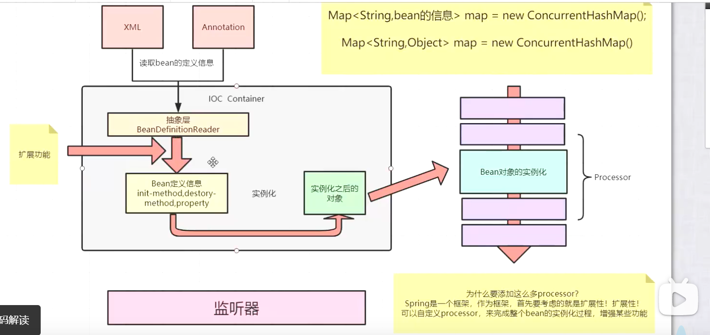
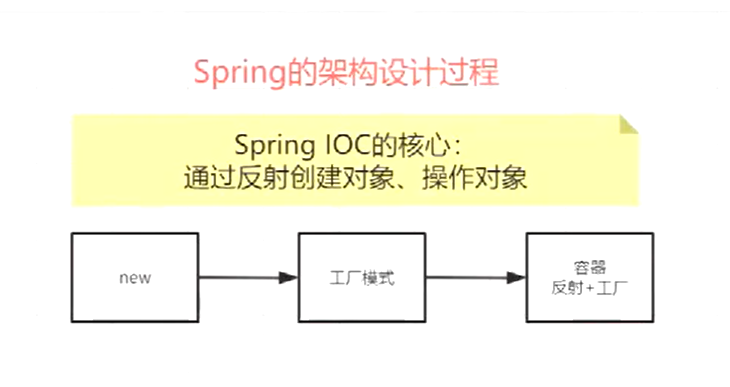
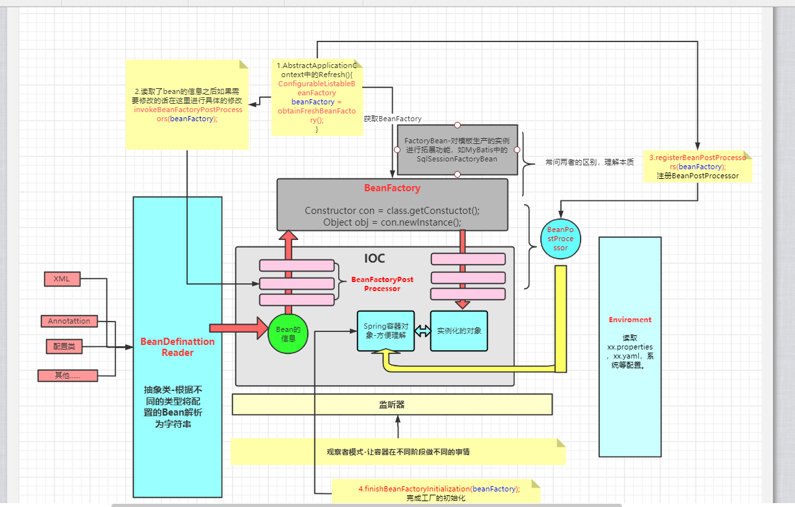
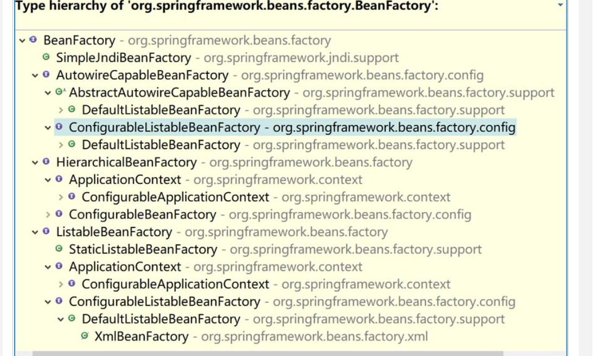
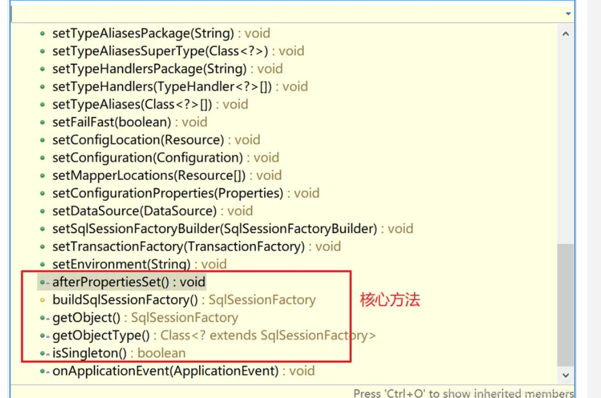
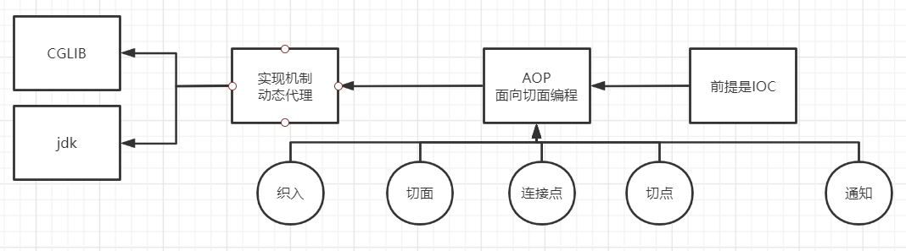
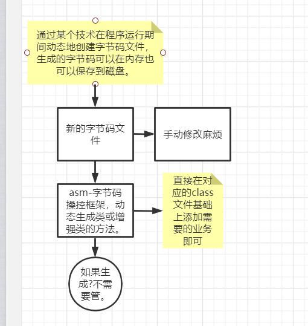
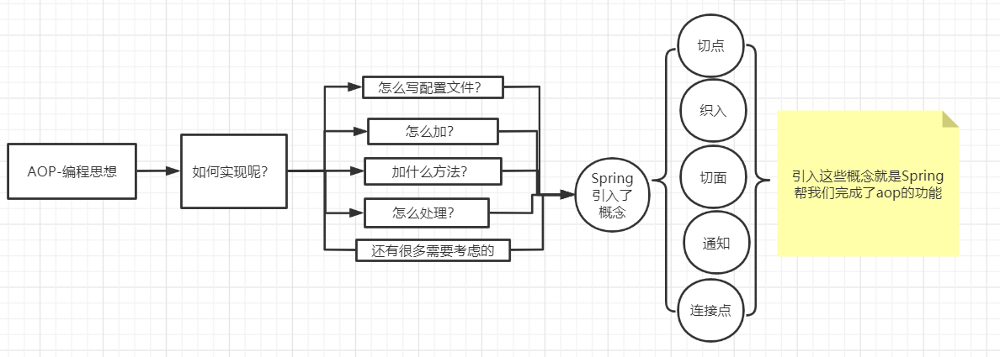
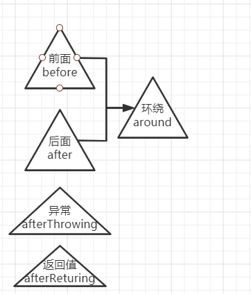
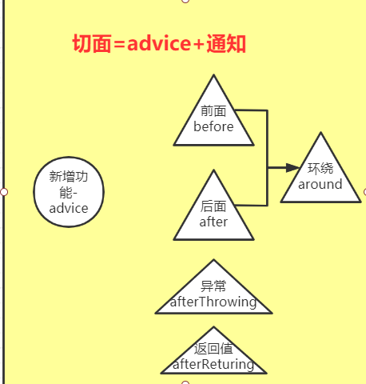

# Spring源码分析

## IOC

### 本质

**底层实现的机制是<font color='red'>反射，本质是存在一个map中，整个容器基于concurrentMap实现。</font>**

### Spring简化版的流程图



简化版的流程图总结：想要称为一个框架必须要考虑的框架的扩展性，Spring提供了什么样的扩展性?

1. 在对象创建之前添加某些功能
2. 在容器初始化之前添加一些功能
3. 在不同阶段发出不同的事件（监听器监听-观察者模式）完成一些功能
4. 抽象出一堆接口来帮助拓展
5. 面向接口编程

### Spring的架构设计过程



### Spring详细版的流程图



### BeanFactory VS FactoryBean

这篇文章主要给大家介绍了关于Spring中BeanFactory与FactoryBean接口的区别的相关资料，文中通过示例代码介绍的非常详细，对大家的学习或者使用Spring具有一定的参考学习价值，需要的朋友们下面来一起学习学习吧

**前言**

Spring框架中的BeanFactory接口和FactoryBean接口因为名称相似，老是容易搞混淆，而且也是面试过程中经常会碰到的一个问题。所以本文就专门给大家整理出来。

**一、BeanFactory接口**

BeanFactory接口是Spring容器的核心接口，负责：实例化、定位、配置应用程序中的对象及建立这些对象间的依赖。



Spring为我们提供了许多易用的BeanFactory实现，XmlBeanFactory就是常用的一个，该实现将以XML方式描述组成应用的对象及对象间的依赖关系。XmlBeanFactory类将持有此XML配置元数据，并用它来构建一个完全可配置的系统或应用。

```java
BeanFactory bf = new XmlBeanFactory(new ClassPathResource("applicationContext.xml"));
Object bean = bf.getBean(IUserService.class);
System.out.println(bean);
```

接口中定义的方法

```java

public interface BeanFactory {
    String FACTORY_BEAN_PREFIX = "&";

    Object getBean(String var1) throws BeansException;

    <T> T getBean(String var1, Class<T> var2) throws BeansException;

    Object getBean(String var1, Object... var2) throws BeansException;

    <T> T getBean(Class<T> var1) throws BeansException;

    <T> T getBean(Class<T> var1, Object... var2) throws BeansException;

    <T> ObjectProvider<T> getBeanProvider(Class<T> var1);

    <T> ObjectProvider<T> getBeanProvider(ResolvableType var1);

    boolean containsBean(String var1);

    boolean isSingleton(String var1) throws NoSuchBeanDefinitionException;

    boolean isPrototype(String var1) throws NoSuchBeanDefinitionException;

    boolean isTypeMatch(String var1, ResolvableType var2) throws NoSuchBeanDefinitionException;

    boolean isTypeMatch(String var1, Class<?> var2) throws NoSuchBeanDefinitionException;

    @Nullable
    Class<?> getType(String var1) throws NoSuchBeanDefinitionException;

    @Nullable
    Class<?> getType(String var1, boolean var2) throws NoSuchBeanDefinitionException;

    String[] getAliases(String var1);
}

```

**二、FactoryBean接口**

BeanFactory接口是Spring的核心接口。功能非常复杂，这个时候如果我们想要编写一些比较复杂点儿的逻辑就会触及到其他一些不必要的接口，不好实现。这时候使用FactoryBean就比较方便了。FactoryBean以Bean结尾是个Bean对象，不是工厂。接口中定义的方法如下:

```java

package org.springframework.beans.factory;

import org.springframework.lang.Nullable;

public interface FactoryBean<T> {
    String OBJECT_TYPE_ATTRIBUTE = "factoryBeanObjectType";

    @Nullable
    T getObject() throws Exception;

    @Nullable
    Class<?> getObjectType();

    default boolean isSingleton() {
        return true;
    }
}

```

**1.简单实现**

接口和实现类

```java
public interface IUserService {

 public void doSome();
}
public class UserServiceImpl implements IUserService {
 public UserServiceImpl(){
  System.out.println("--被实例化了--");
 }

 @Override
 public void doSome() {
  System.out.println("UserServiceImpl 。。。 被执行了");
 }
}
```

自定义FactoryBean

```java
public class MyFactoryBean implements FactoryBean<IUserService>{

 @Override
 public IUserService getObject() throws Exception {
  System.out.println("--IUserService实例化之前---");
  IUserService service = new UserServiceImpl();
  System.out.println("--IUserService实例化后---");
  return service;
 }

 @Override
 public Class<?> getObjectType() {
  return IUserService.class;
 }

 @Override
 public boolean isSingleton() {
  return true;
 }
}
```

配置文件

```xml
<?xml version="1.0" encoding="UTF-8"?>
<beans xmlns="http://www.springframework.org/schema/beans"
 xmlns:xsi="http://www.w3.org/2001/XMLSchema-instance"
 xsi:schemaLocation="http://www.springframework.org/schema/beans 
 http://www.springframework.org/schema/beans/spring-beans.xsd">
 <bean id="myFactoryBean" class="com.dpb.factorybean.MyFactoryBean"/>
</beans>
```

测试--通过类型获取

```java
@Test
public void test1() {
 BeanFactory bf = new XmlBeanFactory(new ClassPathResource("applicationContext.xml"));
 Object bean = bf.getBean(IUserService.class);
 System.out.println(bean);
}
```

输出结果

> --IUserService实例化之前---
> --被实例化了--
> --IUserService实例化后---
> com.dpb.service.UserServiceImpl@5315b42e

**2.增强实现**

通过FactoryBean创建一个代理类来增强目标类，我们来看下效果

接口和实现类

```java
public interface IUserService {

 public void doSome();
}

public class UserServiceImpl implements IUserService { 
 public UserServiceImpl(){
  System.out.println("--被实例化了--");
 }
 @Override
 public void doSome() {
  System.out.println("UserServiceImpl 。。。 被执行了");
 }
}


```

自定义FactoryBean

```java
public class MyFactoryBean implements FactoryBean,InitializingBean,DisposableBean{
 
 private Object proxyObject;
 
 private Object target;
 
 private String interfaceName;

 @Override
 public Object getObject() throws Exception {
  
  return proxyObject;
 }

 @Override
 public Class<?> getObjectType() {
  return proxyObject.getClass()==null?Object.class:proxyObject.getClass();
 }

 @Override
 public boolean isSingleton() {
  return true;
 }

 /**
  * MyFactoryBean 对象销毁的回调方法
  * @throws Exception
  */
 @Override
 public void destroy() throws Exception {
  System.out.println("destroy ....");
  
 }

 /**
  * MyFactoryBean 对象实例化的方法
  */
 @Override
 public void afterPropertiesSet() throws Exception {
  System.out.println("---afterPropertiesSet---");
  proxyObject = Proxy.newProxyInstance(
     this.getClass().getClassLoader()
     , new Class[]{Class.forName(interfaceName)}
     , new InvocationHandler() {
      
      @Override
      public Object invoke(Object proxy, Method method, Object[] args) throws Throwable {
       System.out.println("----代理方法执行开始----");
       Object obj = method.invoke(target, args);
       System.out.println("----代理方法执行结束----");
       return obj;
      }
     });
 }

 public String getInterfaceName() {
  return interfaceName;
 }

 public void setInterfaceName(String interfaceName) {
  this.interfaceName = interfaceName;
 }

 public Object getTarget() {
  return target;
 }

 public void setTarget(Object target) {
  this.target = target;
 }
}
```

配置文件

```xml
<?xml version="1.0" encoding="UTF-8"?>
<beans xmlns="http://www.springframework.org/schema/beans"
 xmlns:xsi="http://www.w3.org/2001/XMLSchema-instance"
 xsi:schemaLocation="http://www.springframework.org/schema/beans 
 http://www.springframework.org/schema/beans/spring-beans.xsd">
 <!-- 注册目标对象 -->
 <bean class="com.dpb.service.UserServiceImpl" id="userServiceImpl"/>
 <!-- 注册FactoryBean对象 -->
 <bean id="myFactoryBean" class="com.dpb.factorybean.MyFactoryBean">
  <property name="interfaceName" value="com.dpb.service.IUserService"/>
   <property name="target" ref="userServiceImpl"/> 
 </bean>
</beans>
```

测试

```java
@Test
public void test1() {
 ApplicationContext ac = new ClassPathXmlApplicationContext("applicationContext.xml");
 IUserService bean = (IUserService) ac.getBean("myFactoryBean");
 System.out.println("****************");
 bean.doSome();
 System.out.println();
}
```

输出结果：

> --被实例化了--
> ---afterPropertiesSet---
> ****************
> ----代理方法执行开始----
> UserServiceImpl 。。。 被执行了
> ----代理方法执行结束----

小结：通过输出结果我们可以看到通过FactoryBean接口我们也可以实现BeanFactory中某些接口提供的功能，而且会更加的灵活一些。

**3.FactoryBean的实际使用案例**

Spring在整合mybatis框架的时候提供的SqlSessionFactoryBean就是FactoryBean的很好的实现。

```xml
<!-- 整合mybatis -->
<bean class="org.mybatis.spring.SqlSessionFactoryBean" 
id="sqlSessionFactoryBean" >
 <!-- 关联数据源 -->
 <property name="dataSource" ref="dataSource"/>
 <!-- 关联mybatis的配置文件 -->
 <property name="configLocation" value="classpath:mybatis-cfg.xml"/>
 <!-- 添加别名设置 -->
 <property name="typeAliasesPackage" value="com.sxt.model"/>
 <!-- 映射文件和接口文件不在同一个目录下的时候，需要单独指定映射文件的路径 -->
 <property name="mapperLocations" value="classpath:mapper/*.xml"/>
</bean>
```

Spring会调用SqlSessionFactoryBean这个实现了FactoryBean的工厂Bean 同时加载dataSource,Mapper文件的路径,对sqlSessionFactory进行初始化。



源代码比较多就不一一贴出来。到了这儿可以自行跟踪下源代码。

核心方法

```java
@Override
 public void afterPropertiesSet() throws Exception {
 // 省略
 this.sqlSessionFactory = buildSqlSessionFactory();
 }

 protected SqlSessionFactory buildSqlSessionFactory() throws IOException {

 Configuration configuration;

 XMLConfigBuilder xmlConfigBuilder = null;
 // 省略
 return this.sqlSessionFactoryBuilder.build(configuration);
 }
/**
 * {@inheritDoc}
 */
 @Override
 public SqlSessionFactory getObject() throws Exception {
 if (this.sqlSessionFactory == null) {
  afterPropertiesSet();
 }

 return this.sqlSessionFactory;
 }

 /**
 * {@inheritDoc}
 */
 @Override
 public Class<? extends SqlSessionFactory> getObjectType() {
 return this.sqlSessionFactory == null ? SqlSessionFactory.class : this.sqlSessionFactory.getClass();
 }

 /**
 * {@inheritDoc}
 */
 @Override
 public boolean isSingleton() {
 return true;
 }
```

maven坐标：

```xml
<dependency>
 <groupId>org.mybatis</groupId>
 <artifactId>mybatis-spring</artifactId>
 <version>1.3.2</version>
</dependency>
```

**三、总结**

- BeanFactory是Spring中IOC容器最核心的接口，遵循了IOC容器中所需的基本接口。例如我们很常见的：ApplicationContext，XmlBeanFactory 等等都使用了BeanFactory这个接口。
- FactoryBean是工厂类接口，当你只是想简单的去构造Bean，不希望实现原有大量的方法。它是一个Bean，不过这个Bean能够做为工厂去创建Bean，同时还能修饰对象的生成。
- FactoryBean比BeanFactory在生产Bean的时候灵活，还能修饰对象，带有工厂模式和装饰模式的意思在里面，不过它的存在还是以Bean的形式存在。

### Bean对象的声明周期

## AOP

### 概况



### AOP出现的一个例子

如果我们要在已经写好的方法中添加日志功能那么我们需要怎么做呢？直接添加在源代码.java文件可以，这种方法只适用于少数方法，如果方法很多很多，都需要添加，那我们难道每一个都手动去修改java源代码文件吗？不现实。

那么我们想如果有这样的方法该多好啊！思路如下图：



那我们到底怎么做呢？aop只是一种思想，我们需要怎么样具体去实现呢？



例如只需要在50个方法添加日志功能，不需要全部都添加，那我们又怎么做呢？既我们自己定义要怎么做，那总得有个规范吧？

**为了形成一种规范，用一种类似正则表达式的东西来进行匹配，在Spring中的这种规范表达式，既expression表达式（方法名字，方法参数，方法返回值，完全限定名字），这个表达式一般用于匹配方法，既在哪里添加功能。**

那我们选择了在那些方法添加功能，那我们只想在方法的前面添加新增的功能，那我们咋做呢？**Spring中有五个表示插入位置的参数，称为<font color = red>通知</font>。**



这些位置叫做通知，那具体需要实现的功能，例如打印一句话，<font color =red>具体添加功能方法叫做**advice**</font>

<font color='red'>**在具体的位置实现了具体的方法就被称为切面。**</font>



以上就是我们所谓的aop编程。